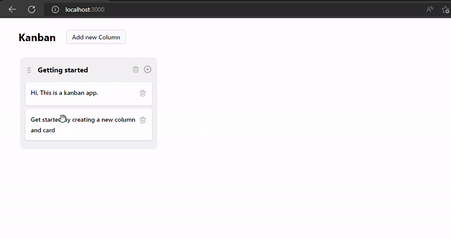

# A kanban app

A kanban app built using **vanilla JS** and **Django**.

# Demo



### Tools required

-  Docker

### Installation

1. Start docker container
   ```docker
   >  docker-compose up --build
   ```
2. Create superuser (optional).
   a. Open shell in django's container (new terminal)

   ```docker
   >  docker exec -it django sh
   ```

   b. Run createsuperuser

   ```python
   #  python manage.py createsuperuser
   ```

3. Open Frontend on **localhost:3000**
4. Backend on **localhost:8000/admin**
5. Swagger API documentation on **localhost:8000/swagger**
